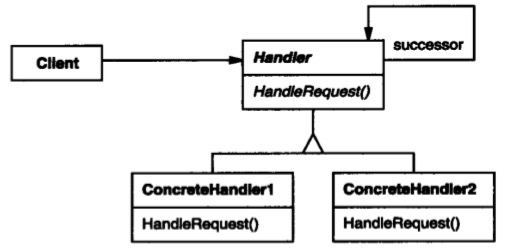

# 责任链模式

## 意图

使多个对象都有机会处理请求，从而避免请求的发送者和接受者的耦合关系。将这些对象连成一条链，并沿着这条链传递请求，直到有一个对象处理它为止。

## 解析





用链表来表示责任传递比较直观：


真实情况可能不是链表，而是树形结构，从根节点往也叶节点传递，也可以是从叶节点往根节点传递。在UI事件中，通常负责事件传递的是Responder。

UI系统中，通常需要处理两套关系：

```
一套是view的父子关系
一套是事件传递链路
```

## 总结

实际应用时需要注意链的复杂度，责任链可以是串链，可以是树链或其他类型，根据业务需求而定。比如在 UI 系统中，一个 view 可以包含多个子 view，nextResponder就需要特殊处理。

另外也要注意请求传递的方向，还以 UI 事件为例，冒泡事件流和捕获事件流处理方式可能不同。

责任链模式使请求发送者不用关心谁去处理问题。


