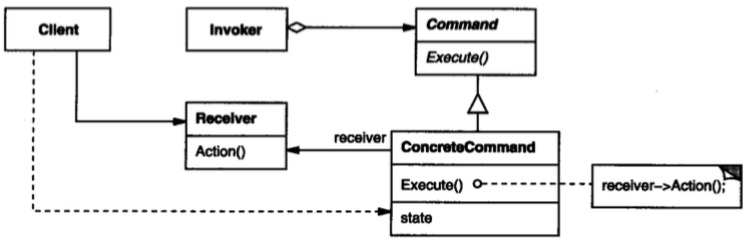

# 命令模式

## 意图

将一个请求封装为一个对象，从而使你可用不同的请求对客户进行参数化，对请求排队或记录请求日志，以及支持可撤销的操作。

## 解析

## 总结

命令模式只有一个execute()方法，容易给人造成简单的假象。说起来其实也容易，将命令这种行为从逻辑中抽离出来，单独形成对象，并抽象为接口可以统一调度。

所谓行为模式就是将行为具象化为对象，命令模式就是比较典型的。命令模式也是一种解耦，将操作者和实施者隔离，可以独立变化。

