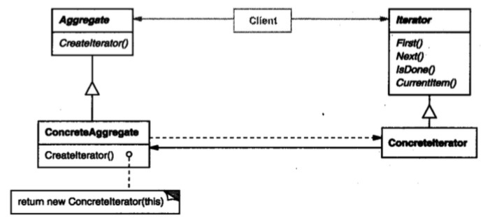

# 迭代器模式

## 意图

提供一种方法顺序访问一个聚合对象中各个元素，而又不需暴露该对象的内部表示。
## 解析





定义一个公共接口：

```java
public interface Iterator {

    public void first();
    public void next();
    public boolean isDone();
    public Object currentItem();
}
```

然后大家都遵循该接口，并实现接口中的方法，使用者就可以通用调用：

```java
 for (iter.first(); !iter.isDone(); iter.next()) {
     //...
 }
```

## 总结

这个模式很好理解，因为日常编程中随处遇到，最常见的就是 foreach，凡事面向对象语言基本都内部支持聚合迭代。

简单来说，就是为了遍历聚合对象单独适配了一个遍历接口，好处是使用者比较方便，不用关心对象的内部构造。

其实是把使用者原先干的事儿转移到了聚合对象中，为什么要转移？我的理解是让专业的人干专业的事儿。


