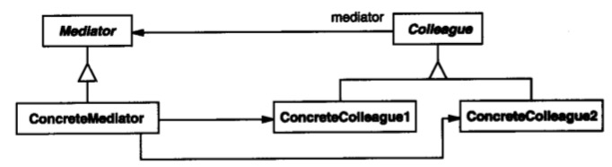
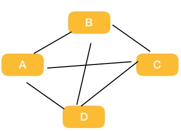

# 中介者模式

## 意图

用一个中介对象来封装一系列对象交互。中介者使各对象不需要显示地相互引用，从而使其耦合松散，而且可以独立的改变他们之间的交互。

## 结构

这个模式理解起来比较简单，具体应用时可能比较繁琐，我们侧重理解，一张图就够了：

现有代码类的依赖关系：

中介者模式解决的方式：

## 总结

中介者比较简单，核心思想是把各对象之间的职责依赖，转换为和中介者之间的依赖，再将中介者对象进行抽象，于是可以各自变化。

中介对象过多时，可能导致中介者对象过于臃肿难以维护。

