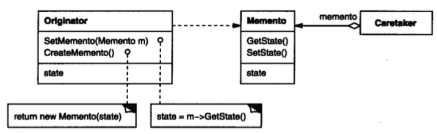

# 备忘录模式

## 意图

在不破坏封装的前提下，捕获一个对象的内部状态，并在该对象之外保存这个状态。这样以后就可将该对象恢复到原先保存的状态。

## 解析





Memento是备忘录对象，其内部保存需要存储的内部数据（外部不可见），内部数据格式只有Originator知道。

Originator是需要进行保存和恢复状态的原始对象，进行Memento构造与解析。

Caretaker对Memento进行保存与获取操作，不关心Memento内部数据。


使用者的角度：

```java
Originator originator = new Originator();
Caretaker caretaker = new Caretaker();

//在 client 看不到内部状态 State

//保存
Memento memento = originator.createMemento();
caretaker.pushMemento(memento);

//恢复
memento = caretaker.pop();
originator.restoreMemento(memento);
```

## 总结

备忘录模式的作用一个是屏蔽外部访问内部状态，一个是将职责划分更清晰。它的神奇之处就在这里，既交给他人备份信息，又不给他人访问内部的权限。


