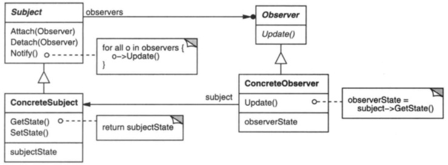

# 观察者

## 意图

定义对象间的一种一对多的依赖关系，当一个对象发生改变时，所有依赖它的对象都得到通知并自动更新。
## 解析

## 总结

观察者模式就是发布和订阅，简单来讲，就是你在网上订阅了某人的文章，或关注某人的微博，当有新的文章或微博发布时，你就收到了更新通知，然后获取信息并阅读。

观察者必须是同类型对象，如果观察者类型不同，就要对所有观察者类型进行约束或抽象出共性。最简单的做法就是让观察者对象共同继承某个接口。

需要单独说明的是，模式中除了收到通知，还有一个行为，是观察者从被观察者获取数据更新。数据更新可以是观察者主动去获取，也可以设计为将消息附加到通知上携带，也就是主动和被动的关系。两者各有优缺点，根据项目需求择优选择。

