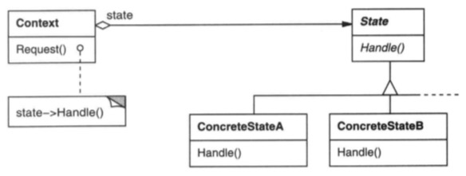

# 状态模式

## 意图

允许一个对象在其内部状态改变时改变它的行为。对象看起来似乎修改了它的类。

## 解析




所谓状态机可以理解为一个状态标志，不同条件下其状态不一样：

```java
int state = 0;  //0: 初始状态 1: 就绪状态  2: 运行状态 ……
```

状态模式主要和普通状态标志的区别在于内在驱动，状态标志，主要靠我们主动获取，根据其目前状态做不同处理，典型的就是switch语句：

```java
switch (state) {
    case 0:
        //process
    case 1:
        //process
    case 2:    
        //process
    default:
        break;
}
```

状态模式呢，只需要更改其状态，后续流程会按照新状态处理。据上图可知，不同状态的处理可以自动执行，是因为约束每个状态都必须实现统一的接口。

对于包装类来说：

```java
public class Process {
    private IState state;
    public request() {
        state.handle();  //不同关心是那种状态，只需要调用该状态的处理方法就好了
    }
}

```

## 总结

状态模式其实就是个状态机，随着事物变化，内部状态也在发生着变化。每种内部状态都是具有相同接口的对象，每个状态接口实现都不同，外部看来就像是修改了接口行为。

状态模式和策略模式非常类似，除了两者的目的不同外，最大的区别是策略模式算法的改变是客户行为，而状态模式状态的改变是内部变动，客户没有感知，也无法干预。


