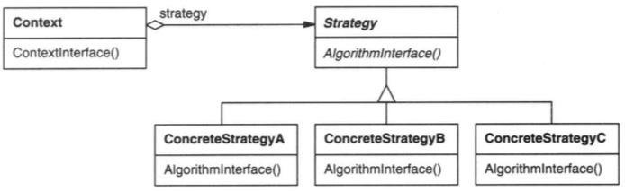

# 策略模式

## 意图

定义一系列的算法，把他们一个个封装起来，并使它们可以相互替换。本模式使得算法可独立于使用它的客户而变化。

## 解析

从技术角度讲，策略模式与状态模式没有本质区别，都是实现统一接口，把不同的处理流程封装在统一接口中，供使用者调用。

两者的区别在于：策略模式的使用者是客户程序，状态模式的使用者是封装类（自身）。

## 总结

和状态模式类似，唯一区别不是自动替换。

