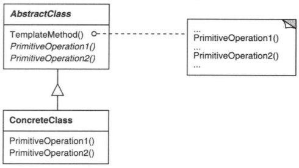

# 模板方法

## 意图

定义一个操作中的算法的骨架，而将一些步骤延迟到子类中。模板方法使得子类可以不改变一个算法的结构即可重新定义该算法的某些特定步骤。

## 解析




可以看到`TempleteMethod`实现的就是所谓的算法的结构，其中调用了其他的具体算法，TempleteMethod定义了一个标准的算法步骤模板，即算法的步骤是不变的，比如文件的操作：`打开、关闭、读取、写入`，不同文件的操作方式不一样，但总的操作流程都一致：

```java
abstract class FileManager {
    public void ProcessFile(String fileName) {
        if (!canOpen(fileName)) {
            return;
        }

        openFile(fileName);
        Stream data = readData();
        //other operator
        writeData(data);
        closeFile();
    }

    abstract void openFile(String fileName);
    abstract void closeFile();
    abstract Stream readData();
    abstract bool writeData(Stream data);
}
```

这样不管是哪种类型的文件操作，都可以使用该模板方法操作，具体文件类型的操作，交给子类实现进行处理。

```java
public class TextFileManager extends FileManager {
    // 文本文件的操作
    //openFile  closeFile  readData writeData
}

public class ExcelFileManager extends FileManager {
    // excel 文件的操作
}
```


## 总结

又是延迟到子类，延迟意味着将实体方法抽象为接口方法，和工厂方法思路是一致的，并且和工厂方法极其相似。表面上看，工厂方法延迟了一个方法，模板方法延迟了多个方法，技术角度两者没有本质区别。

但是两者的目的不一样，工厂方法是用于创建对象，并且没有依赖其他方法。而模板方法用于算法的，这个算法一词让我疑惑了好几年，不明白具体什么意思，现在才想明白这里所谓的算法是指一系列相关的步骤。

模板方法有多个相互依赖的方法，而某个或几个方法是容易变化的，为了应对变化，就把容易变化的方法做了抽象，这就是模板方法。

假如模板方法中存在创建对象的特定步骤，说明模板方法中使用了工厂方法，工厂方法是模板方法的子集。


