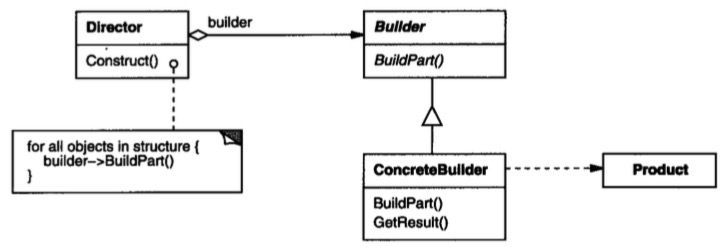

# 生成器模式

## 意图

将一个复杂对象的构建与它的表示分离，使得同样的构建过程可以创建不同的表示。

## 解析

生成器核心点有两个：

1. 构造复杂对象时有用，并且复杂对象的各个部件可以有多种组合关系
2. 各个部件的组合方式由单独的对象去管理（Director）

## 总结

builder负责创建各个部件的创建，并在最后返回复杂对象，表示部分是客户程序的工作，客户不用关心对象的具体创建过程，以及各个部件之间的复杂关系。

这样就简化了客户与复杂对象之间的耦合关系，各自可以独立变化。

所谓同样的构建过程可以创建不同的表示，意思是单独抽离出复杂对象的构建过程（示例代码中的HouseManager类），这样又实现构建过程与部件创建的解耦，一旦部件发生变化，只需要变换 builder 即可。

生成器用户一般可以这么使用：builder.buildA().buildB().buildC()。

