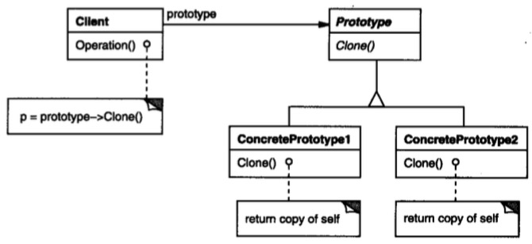

# 原型模式

## 意图

用原型实例指定创建对象的种类，并通过拷贝这些原型创建新的对象。

## 解析

原型就是实现`clone`方法，好简单。原型模式属于创建型，因此它是为了解决new对象的问题，clone解决new的什么问题？

我们知道new是用类创建一个初始化的实例，这个实例在运行过程中会不断变化，当这个实例的属性过多，并且在运行时不断改变时，要重新new一个一模一样的实例不是件简单的事情。

尤其是交给其他人去new：

你new一个我，要一模一样哦：

你clone一个我，要一模一样哦：

## 总结

其实说白了就是给类提供一个克隆方法，可以通过克隆（内存拷贝）创建同类型的对象，成本低廉，不用关心要创建的对象类型以及如何创建对象。一般用于创建大量同类型对象的场景，如粒子系统。

需要注意的有两点：

	一、为了封装变化，需要把类抽象为接口，调用者不需要关心具体类；
	二、克隆方法需要深拷贝，如果对象组合嵌套太深就失去了原型的意义。
	

