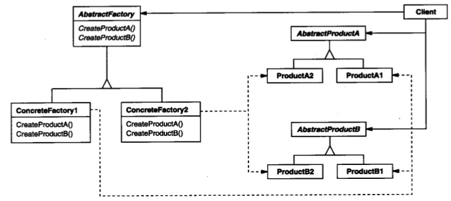

# 抽象工厂

## 意图

提供一个创建一系列相关或相互依赖对象的接口，而无需指定它们具体的类。

## 解析





## 演变过程

最初发现 new 的硬编码是因为项目复杂，并且需求发生了变化，要用新的对象替换旧对象。全文多处替换对象带来不可预知的风险，怎么解决呢？可以把所有需要变化的对象放在一个 class 里统一创建，这个 class 就像配置文件一样，当有需要替换的类，只需要修改这个配置类中即可。

这个配置类就是一个类工厂，专门用来创建对象来着。

```java
public class ClassFactory {
    public static ProductA createProductA() {
        //...
    }
    public static ProductB createProductB() {
        //...
    }
    public static ProductC createProductC() {
        //...
    }
}

ProductA a = ClassFactory.createProductA();
ProductB b = ClassFactory.createProductB();
ProductC c = ClassFactory.createProductC();
```

再后来，对一些公共的基础的类要形成类库，这时候新的问题出现了：类库中的依赖关系类需要操作类工厂对象，但是这些对象是由类库使用者提供的，类库是不知道使用者具体使用的对象是什么。

解决这个问题，只需要把依赖的类型告诉使用者，使用者创建符合类型的对象给类库就可以了。这个过程，就是对类工厂进行抽象，形成接口，由调用者实现接口。

将类工厂进行抽象是什么？对的，就是抽象工厂（汗……）。

```java
public interface IFactory {
    public ProductA createProductA();
    public ProductB createProductB();
    public ProductC createProductC();
}

public class BlackFactory implements IFactory {
    //...
}

public class WhiteFactory implements IFactory {
    //...
}
```

```java
public class ClientClass {
    public process(IFactory factory) {
        ProductA a = factory.createProductA();
        //...
    }
}
```

更进一步的话，可以把Product也进行抽象，形成接口，来应对变化。