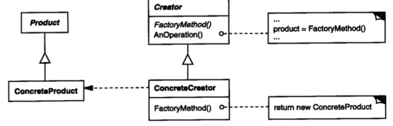

# 工厂方法

## 意图

定义一个用于创建对象的接口，让子类决定实例化哪一个类。

## 解析

`Creator`是一个抽象类，该类需要进行一些操作依赖另一个类的方法，但是呢，依赖类属于客户程序创建的（ConcreteCreator），该类的具体功能由客户进行自定义。所以Creator定义一个抽象方法，用来返回客户类的对象。

事实上不只是可以应用在创建对象的场景，凡是不确定性的行为均可以延迟到子类去实现。

## 总结

该模式的应用场景是依赖客户程序创建的对象，实际情况是我们无法判断客户创建什么对象，解决方式就是将权利交给客户，客户端创建对象并传递我们使用。

工厂方法采用的是继承方式，如果只是想要客户创建对象，也可以采用组合方式。

