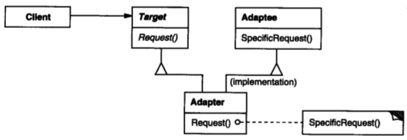
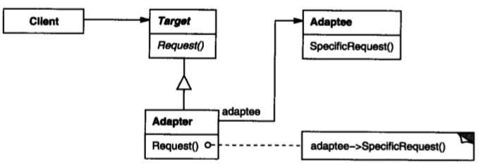

# 适配器模式

## 意图

将一个类的接口转换成客户希望的另外一个接口。Adapter模式使得原本由于接口不兼容而不能一起工作的那些类可以一起工作。

## 解析

## 总结

这个模式比较简单，既然要适配成客户希望的接口，必然已有一个接口（示例中的IStack），将既有类适配成某接口，有两种方式：一、继承实现（MyStack）；二、组合实现（InheritStack）。

按照面向对象的设计原则，组合一般要优于继承，这里也不意外。

继承实现的缺点有两个：

	一、继承会污染继承类的方法空间，意思就是继承类会继承一些不需要的方法，甚至方法和本类职责有冲突或二义性。
	
	二、要适配必然有两个类或接口，如果客户提供的不是接口，那么就牵扯到多重继承，而多重继承比较复杂并且有些语言不支持。

