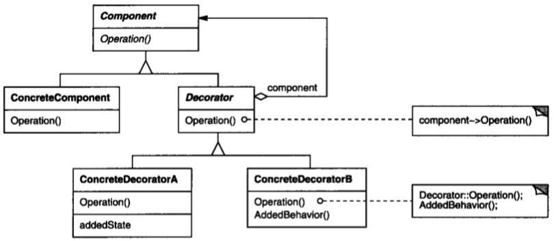
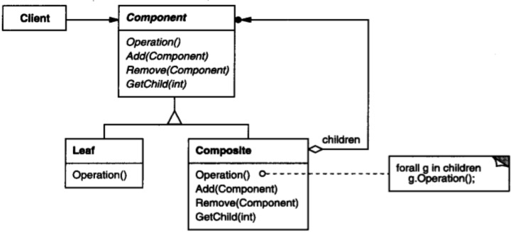
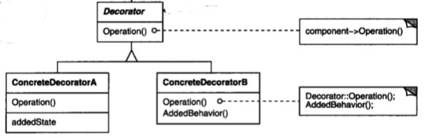

# 装饰模式

## 意图

动态的给一个对象添加一些额外的职责。就增加功能来说，装饰模式相比生成子类更加灵活。


## 解析




我们再来看下组合的结构图：



发现什么了？两者几乎一样。

只是装饰模式在组合模式的基础上，扩展了一下，注意看Decorator是抽象类，意味着真正的意图是让它的子类实现Operation方法。

先看装饰模式的成效，可以这样使用：

```java
new ConcreteComponentA(new ConcreteComponentB( new ConcreteComponent()))
```

意味着，可以在基础ConcreteComponent之上，动态添加新的功能ConcreteComponentA和ConcreteComponentB。

假如把其他部分屏蔽，只是实现装饰部分：



那么任何装饰类可以任意组合，似乎更灵活了。增加ConcreteComponent，目的是在基础类上（ConcreteComponent）任意组合装饰类（ConcreteComponentA、ConcreteComponentB）。

## 总结

当遇到多个对象可以任意组合时就该装饰模式发挥强大作用了，它可以这么用：I = new A( new B (new C() ) )，看使用方式就知道，如果 A 和 B 和 C 之间不存在强依赖关系，那么 A 和 B 和 C 就是任意组合的关系。

说任意组合是针对类图而言，实际上装饰模式不是任意组合关系，任意组合仅是指装饰部分（ASCII7Stream、CompressingStream），基础类是不能任意组合的（FileStream、MemoryStream），即只能在`一个`基础类上添加任意装饰。

要限制装饰只能加在基础对象上就需要对参数做些限制，当然，这是细节问题。


