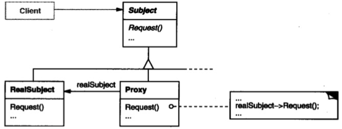

# 代理模式

## 意图

为其他对象提供一种代理以控制对这个对象的访问。

## 解析




`Proxy`是代理对象，`RealSubject`是被代理对象。Proxy所有的接口都来源于RealSubject，不能私自增加或减少，对使用者来说，使用RealSubject或Proxy对象没有什么区别。

从代码角度分析：

```java

public class Proxy {
    //被代理的对象
    private RealSubject subject;

    public void Request() {
        subject.Request();
    }
}
```

看起来没什么问题，对不对，再看下RealSubject的实现：

```java
public class RealSubject {
    public void Request() {
        //....
    }
}
```

看出问题了吗？两个类之间的关系，仅仅是Proxy采用`组合`方式调用了RealSubject的方法，不过确实`代理`了其方法。再对比上面的类结构图，图中Proxy和RealSubject同时继承了同一个接口类，这是为什么？

前面说`对使用者来说，两者没有什么区别`，意味着无论传递给客户程序Proxy还是RealSubject，都能达到客户的要求。上面的实现属于硬编码，缺乏应对变化，正确的实现方式应该是：

```java
public interface Subject {
    public void Request();
}

public class RealSubject implements Subject {
    public void Request() {
        //...
    }
}

public class Proxy implements Subject {
    private RealSubject subject;

    public void Request() {
        subject.Request()
    }
}
```

这样，客户程序就可以采用接口，当更换代理对象时，客户程序可以不更改或最小量的修改。

```java
public void commit(Subject) {
    subject.Request();
}
```

## 总结

意思很明显，就是在两个关联对象之间加上一层，不过这一层不是中介，而是其中一个对象的包裹器，将一个对象包括起来有很多好处，可以控制外部的访问权限，可以更改对象的行为，还可以做其他很多好玩的。

需要注意的一点是，代理模式只是做对象的代理，本身并不改变对象的行为，也就是说代理对象和被代理的对象行为基本一致，它们都共同继承自同一个接口。


